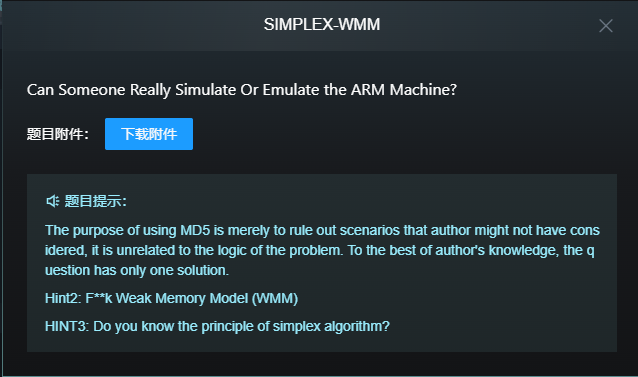
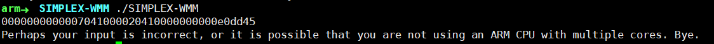

# SIMPLEX-WMM

# Key Points for Solving the Problem
* Triggering exception branches through ARM's WMM is the main logic of the question.
* The memory operations of the two threads mainly serve to cause concurrent memory access and lead to WMM's memory inconsistency. The random scheduling of threads in the main thread is also designed to increase this phenomenon's occurrence.
* Normal execution and printing of the FLAG are not possible on chips with TSO (Total Store Order) memory model, such as x86. It is essential to use chips like ARM with WMM for the FLAG to be printed correctly.
* The usage of 1GB memory contamination allows the program to print the *CTF FLAG at an indeterminate time within approximately 0 to 30 seconds if the input is correct. If the input is incorrect or chips with WMM, like ARM, is not used, the program will print an error message after 3 minutes.
```
Perhaps your input is incorrect, or it is possible that you are not using an ARM CPU with multiple cores. Bye.
```
* The above restrictions only limit some additional operations like dynamic debugging, so the best approach is still to manually reverse-engineer the code. This can be done from two directions. First, the data flow tracing, as this question does not employ any obfuscation on the input, making it possible to trace the input. The second perspective is the condition of printing FLAG, which is controlled by a global variable. By cross-referencing, it is possible to locate the modification point of the condition variable and uncover the true program logic.
* The logic behind is to verify the solution of a simple linear programming problem.
$$
Max: 70x_1+65x_2+80x_3+75x_4 \\
st: \\
4x_1+4x_2+3x_3+7x_4 \leq 90 \\
6x_1+3x_2+5x_3+4x_4 \leq 120 \\
5x_1+2x_2+3x_3+3x_4 \leq 60 \\
6x_1+5x_2+x_3+2x_4 \leq 100 \\
x_1,x_2,x_3,x_4  \geq 0
$$
* The verification logic modified the simplex algorithm, which is commonly used to solve linear programming problems, to obtain the optimal solution through relaxation. However, in this question, the player's answer is incorporated into the initial conditions. If relaxation still leads to a non-zero result value, it indicates that the player's answer is not the optimal solution. On the other hand, if it is the optimal solution, further relaxation will not yield any value.
* The optimal solution is
$$
x_1 = 0, x_2 = 15, x_3 = 10, x_4 = 0, max = 1775
$$
* Concatenate the above values in the order of float 32-bit encoding and it's your FLAG.


# 解题要点
* 通过 ARM 的 WMM 去触发异常分支，异常分支才是题目的主逻辑。
* 两个线程的内存操作的主要作用是进行访存并发竞争，导致 WMM 的内存不一致性发生。主线程中线程的随机调度也是为了增加这一现象的发生。
* 没法正常在 x86 这种 TSO 内存模型芯片中正常运行打印出FLAG。必须在 ARM 等 WMM 芯片上才能正常运行打印 FLAG.
* 使用了1G的内存污染，如果解题输入正确，可在约0~30秒内不定的时间中打印出*CTF FLAG。若输入错误或者没有使用ARM 等WMM芯片，程序会在3分钟打印错误提示
```
Perhaps your input is incorrect, or it is possible that you are not using an ARM CPU with multiple cores. Bye.
```


* 前面的限制只是限制了动态调试等一些额外操作，故最好的方式还是手撕硬逆，从两个方向相向入手，一个方向是数据流的追踪，本题没有对输入进行任何的混淆使用，所以可以对输入进行追踪。另一个方向是打印FLAG的条件，条件是一个全局变量，可以通过交叉引用定位到修改条件变量的地方，从而找到真正的程序逻辑。
* 逻辑是验证一个简单的线性规划问题的解：
$$
Max: 70x_1+65x_2+80x_3+75x_4 \\
st: \\
4x_1+4x_2+3x_3+7x_4 \leq 90 \\
6x_1+3x_2+5x_3+4x_4 \leq 120 \\
5x_1+2x_2+3x_3+3x_4 \leq 60 \\
6x_1+5x_2+x_3+2x_4 \leq 100 \\
x_1,x_2,x_3,x_4  \geq 0
$$
* 验证逻辑修改了单纯型算法，单纯型算法去解决线程规划问题的，通过松弛得到最优解。而本题，将选手给的答案引入到初始条件中，如果还能松弛得到一个非0的目标值，则说明选手的答案不是最优解，如果是最优解，则不能进一步松弛得到一个值。
* 最优解为
$$
x_1 = 0, x_2 = 15, x_3 = 10, x_4 = 0, max = 1775
$$
* 将以上值按照 float 32bit 编码依次连接就是就是 FLAG。
